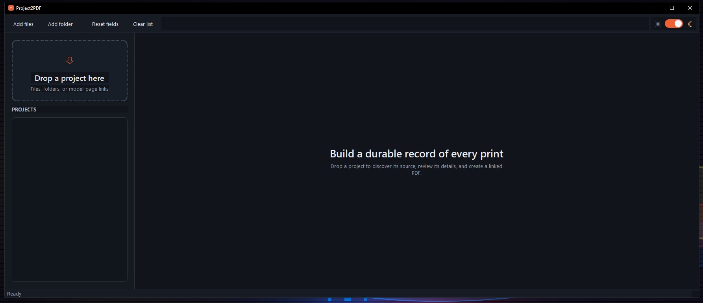
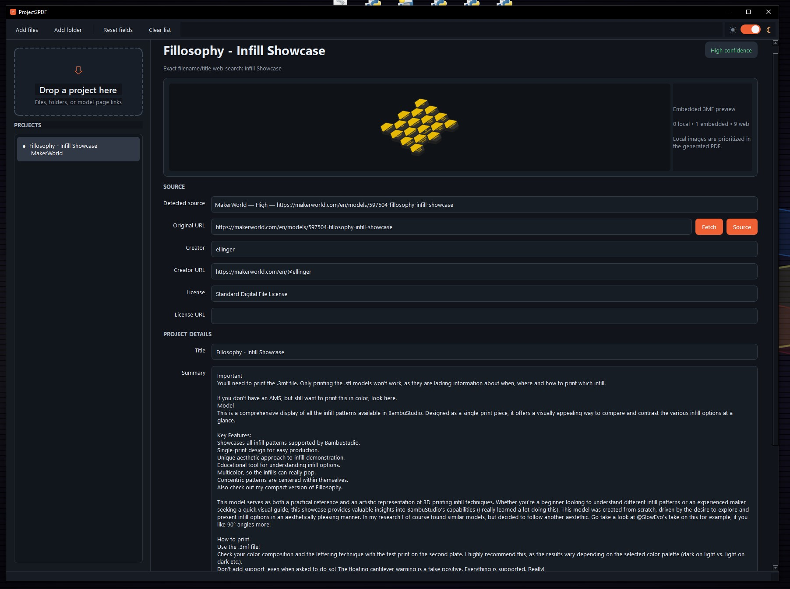
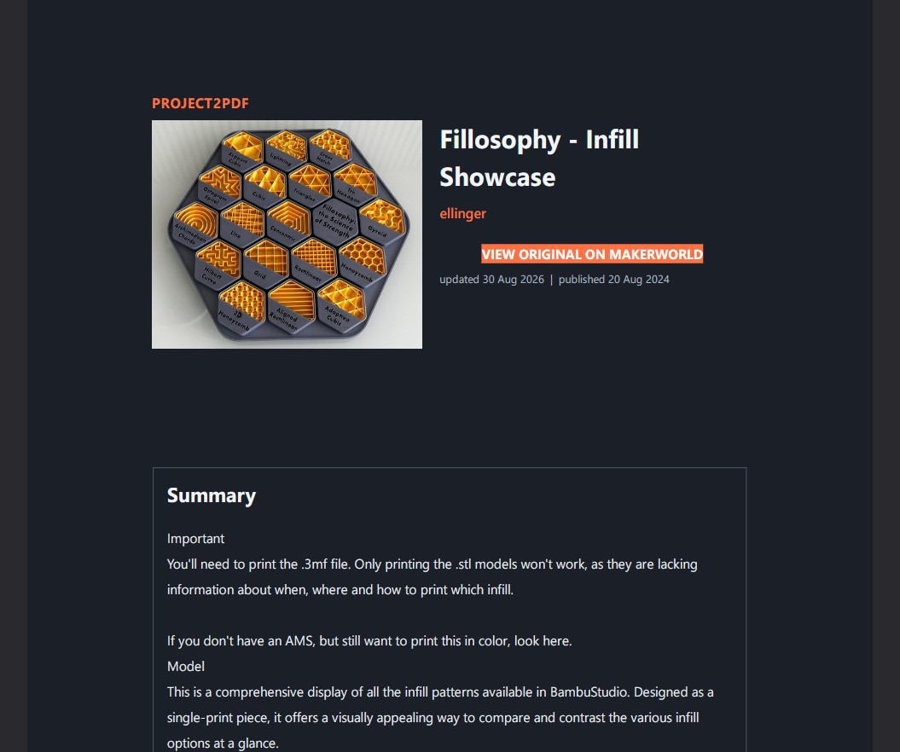

# Project2PDF

Project2PDF turns downloaded 3D-print files, project folders, and model-page links into PDFs that retain the information needed months or years later: the original listing, creator, photographs, description, print guidance, model files, dimensions, slicer settings, and license.

The desktop app uses a light/dark PySide6 interface and accepts drag-and-drop input from Explorer and web browsers.

## Supported sources

- Printables
- MakerWorld
- Thingiverse
- Creality Cloud
- Thangs
- Yeggi links, resolved to their original listing
- 3Drop links, resolved to their original listing
- Other pages through Open Graph and JSON-LD metadata when possible

Project2PDF never uploads model geometry. Filename-based discovery sends only the filename or title to a search page. Website layouts and access controls change over time, so every detected source includes confidence and evidence and remains editable before PDF creation.

## Screenshots

### Main Window



### Imported project



### Generated PDF



## Download

Download the latest Windows build from the
[Releases](https://github.com/StevenM1080/Project2PDF/releases) page.

For Windows 64-bit, download:

`Project2PDF-v0.1.0-Windows-x64.exe`

No Python installation is required for the packaged Windows build.

## Using the application

1. Drop a file, folder, or model-page link onto the drop area.
2. Review the detected source and confidence evidence. If no source is found, paste the original model-page URL into **Original URL** and select **Fetch** to use it as the metadata seed.
3. Check the image preview and correct or expand the title, creator, description, print instructions, tags, or license if needed. Images found in the dropped folder are kept and prioritized ahead of website images in the PDF.
4. Choose the light (sun) or dark (moon) app and PDF theme from the top-right switch.
5. Select **Generate this PDF** or **Generate all PDFs**.

When a dropped folder contains supported files in multiple nested directories, Project2PDF asks whether to create one combined project or split the contents. Split mode provides a file-by-file assignment table: choose an existing PDF group, type a new group name, or exclude a file. Existing PDFs are inspected for clickable source and license links. 3MF packages are inspected for Bambu/3MF metadata, embedded photographs, plate previews, model names, and slicer settings. STL files provide geometry and dimensions; on Windows, Project2PDF also checks the `Zone.Identifier` download stream for the original referrer and download URL.


## Building from Source

Requires Python 3.11 or newer.

```powershell
git clone https://github.com/StevenM1080/Project2PDF.git
cd Project2PDF

python -m venv .venv
.\.venv\Scripts\Activate.ps1
python -m pip install -e ".[dev]"

project2pdf-gui


## Tests

```powershell
.\.venv\Scripts\pytest.exe
```
